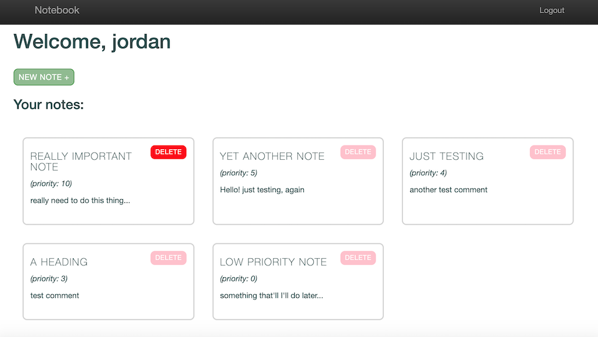

# Notebook App

A simple Django web app for taking notes

:pencil:

Register, write, prioritise and delete notes.

###### Installation:
_requires python 3.7_
```
$python manage.py makemigrations
$python manage.py migrate
```
###### To Run _(localhost:8000/)_:
```
python manage.py runserver
```

###### Sample:

